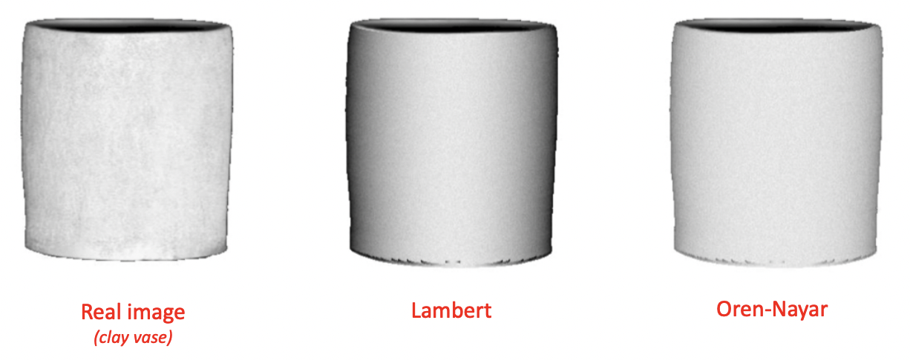

# Assignment 16 (BRDF Models)

BRDF = diffuse reflection + specular reflection

**Diffuse reflection**: main color of the object.

**Specular Reflection**: effect which shiny objects give when they reflect light in a particular angle.

In **scan-line rendering**, values of the BRDF are in the range $[0, 1]$. Since lights may change those values and make them higher than 1 we need to `clamp` the values at the end of the computation:
$$
\begin{gathered}
L\left(x, \omega_{r}\right)=\operatorname{clamp}\left(\sum_{l} L(l, \vec{x}) f_{r}\left(x, \overrightarrow{l x}, \omega_{r}\right)\right) \\
\operatorname{clamp}(y)=\left\{\begin{array}{cc}
0 & y<0 \\
y & y \in[0,1] \\
1 & y>1
\end{array}\right.
\end{gathered}
$$
**HDR** instead allows values outside of the $[0, 1]$ range, while mapping values outside of that interval into values inside of it via non-linear functions.

## Diffuse reflection models

### Lambert

According to the reflection law by Lambert, each point of an  object hit by a ray of light, reflects it with uniform probability in all the directions.

The reflection is thus independent of the viewing angle and it  corresponds to a constant BRDF: $f_{r}\left(x, \omega_{i}, \omega_{r}\right)=\rho_{x}$.

The quantity of light received by an object is however not  constant: it depends on the angle between the ray of light and reflecting surface. Suppose we have the following parameters:

* $n_x$: unitary normal vector to the surface;
* $d$: direction of ray of light;
* $\alpha$: angle between the two vectors.

The incidence of the incoming light is maximized when angle $\alpha$ is $0^{\circ}$, and null if it is greater or equal than $90^{\circ}$. In particular, Lambert has shown that the amount of light  reflected is proportional to $\cos{\alpha}$, which can be computed as $\cos{\alpha} = n_x \cdot d$. In the assignment this becomes: `dot(L, N)`.

We can express the BRDF of the Lambert reflection for scan-line rendering  with the following expression: 
$$
f_{r}\left(x, \overrightarrow{l x}, \omega_{r}\right)=f_{\text {diffuse }}(x, \overrightarrow{l x})=\boldsymbol{m}_{D} \cdot \max \left(\overrightarrow{l x} \cdot \boldsymbol{n}_{x}, 0\right)
$$
Which in shaders code becomes:

```c
// vec3 C: color of the surface (RGB vector)
f = C * max(dot(L, N), 0.0);
```

###  Oren-Nayar

Idea: some materials are characterized by a phenomenon called retroreflection: they tend to reflect back in the direction of the light source. They are characterized by very rough surfaces, and they cannot be accurately simulated with the Lambert diffuse reflection model. The Oren-Nayar diffuse reflection model has been devised to more appropriately model such materials.

Typical real life materials that require this special technique are  clay, dirt and some types of cloths:



It requires three vectors:

1. $d$: direction of the light;
2. $n$: normal vector;
3. $\omega_r$: direction of the viewer.

The model is characterized by two parameters:

1. $m_{D}=\left(m_{R}, m_{G}, m_{B}\right)$: main color of the material;
2. $\sigma \epsilon\left[0, \frac{\pi}{2}\right]$: roughness of the material, higher values of $\sigma$ produces rougher surfaces. If $\sigma = 0$ it converges to the Lambert diffusion.

The model, can be computed with the following formulas:
$$
\begin{gathered}
\theta_{i}=\cos ^{-1}\left(\overrightarrow{l x} \cdot \boldsymbol{n}_{x}\right) \\
\theta_{\boldsymbol{r}}=\cos ^{-1}\left(\omega_{r} \cdot \boldsymbol{n}_{x}\right) \\
\alpha=\max \left(\theta_{\boldsymbol{i}}, \theta_{\boldsymbol{r}}\right) \\
\beta=\min \left(\theta_{\boldsymbol{i}}, \theta_{\boldsymbol{r}}\right) \\
A=1-0.5 \frac{\sigma^{2}}{\sigma^{2}+0.33} \\
B=0.45 \frac{\sigma^{2}}{\sigma^{2}+0.09} \\
\boldsymbol{v}_{\boldsymbol{i}}=\text { normalize }\left(\overrightarrow{l x}-\left(\overrightarrow{l x} \cdot \boldsymbol{n}_{x}\right) \boldsymbol{n}_{x}\right) \\
\boldsymbol{v}_{\boldsymbol{r}}=\text { normalize }\left(\omega_{r}-\left(\omega_{r} \cdot \boldsymbol{n}_{x}\right) \boldsymbol{n}_{x}\right) \\
G=\max \left(0, \boldsymbol{v}_{\boldsymbol{i}} \cdot \boldsymbol{v}_{\boldsymbol{r}}\right) \\
L=m_{D} \cdot \operatorname{clamp}\left(\overrightarrow{l x} \cdot \boldsymbol{n}_{x}\right) \\
f_{diffuse} = \left(x, \overrightarrow{l x}, \omega_{r}\right)=L(A+B G \sin \alpha \tan \beta)
\end{gathered}
$$
Which in code become:

```c
	float thi = acos(dot(L, N));
	float thr = acos(dot(V, N));
	float alpha = max(thi, thr);
	float beta = min(thi, thr);
	float A = 1 - 0.5 * pow(sigma, 2) / (pow(sigma, 2) + 0.33);
	float B = 0.45 * pow(sigma, 2) / (pow(sigma, 2) + 0.09);
	vec3 vi = normalize(L - dot(L, N) * N);
	vec3 vr = normalize(V - dot(V, N) * N);
	float G = max(dot(vi, vr), 0.0);
	vec3 L1 = C * clamp(dot(L, N), 0.0, 1.0);
	return L1 * (A + B * G * sin(alpha) * tan(beta));
```

### Toon

Toon shading simplifies the  output color range, using only discrete values according to  a set of thresholds. In this way it achieves a cartoon-like rendering style. It can be used both for the diffuse and specular components of the BRDF.

The technique starts from a standard Lambert BRDF for the diffuse, and from a Phong or Blinn BRDF with $\gamma = 1$ for the specular components. Then it uses two colors $(m_{D1}, m_{D2})$ or $(m_{S1}, m_{S2})$ and a threshold ($t_D$ or $t_S$) for determining which one to choose.
$$
\begin{aligned}
&f_{\text {diffuse }}(x, \overrightarrow{l x})= \begin{cases}\boldsymbol{m}_{D 1} & \overrightarrow{l x} \cdot \boldsymbol{n}_{x} \geq t_{D} \\
\boldsymbol{m}_{D n} & \overrightarrow{l x} \cdot \boldsymbol{n}_{x}<t_{D}\end{cases}
\end{aligned}
$$

## Specular reflection models

### Phong

In the Phong model, the specular reflection has the same  angle as the incoming ray with respect to the normal vector,  but it is oriented in the opposite direction, and it is positioned on the same plane as the light and the normal vectors.

The Phong model computes the intensity of the specular reflection from $\cos{\alpha}$: in this way the term is maximum if the  specular direction is aligned with the observer, and zero  when the angle is greater than $90^{\circ}$.

To create more contained highlight regions, the term $\cos{\alpha}$ is  raised at a power $\gamma$. The greater is $\gamma$, the smaller is the  highlight, and the more shiny the object appears to be.

Computation steps:

1. First we compute $n'$,  the projection of the light vector over the normal vector: $n^{\prime}=n_{x} \cdot\left(d \cdot n_{x}\right)$;

2. $d' = n' - d$;

   $r = d + 2d'$, or with the notation of the rendering equation: $\boldsymbol{r}_{l, x}=2\left(\overrightarrow{x l} \cdot \boldsymbol{n}_{x}\right) \boldsymbol{n}_{x}-\overrightarrow{x l}$;

   Where $r$ is the reflected vector. In GLSL we can also do: `vec3 r = -reflect(L, N); `;

3. We can then compute the intensity of the specular reflection term as: $\operatorname{CoS}^{\gamma} \alpha=\operatorname{clamp}\left(\omega_{r} \cdot \boldsymbol{r}\right)^{\gamma}$.

To summarize:
$$
\begin{gathered}
\boldsymbol{r}_{l, x}=2 \boldsymbol{n}_{x} \cdot\left(\overrightarrow{l x} \cdot \boldsymbol{n}_{x}\right)-\overrightarrow{l x} \\
f_{\text {specular }}\left(x, \vec{x}, \omega_{r}\right)=\boldsymbol{m}_{S} \cdot \operatorname{clamp}\left(\omega_{r} \cdot \boldsymbol{r}_{l, x}\right)^{\gamma}
\end{gathered}
$$

### Toon

$$
\begin{aligned}
\boldsymbol{r}_{l, x} &=2 \boldsymbol{n}_{x} \cdot\left(\overrightarrow{l x} \cdot \boldsymbol{n}_{x}\right)-\overrightarrow{l x} \\
f_{s p e c u l a r}\left(x, \overrightarrow{l x}, \omega_{r}\right) &= \begin{cases}\boldsymbol{m}_{S 1} & \omega_{r} \cdot \boldsymbol{r}_{l, x} \geq t_{S} \\
\boldsymbol{m}_{S 0} & \omega_{r} \cdot \boldsymbol{r}_{l . x}<t_{S}\end{cases}
\end{aligned}
$$