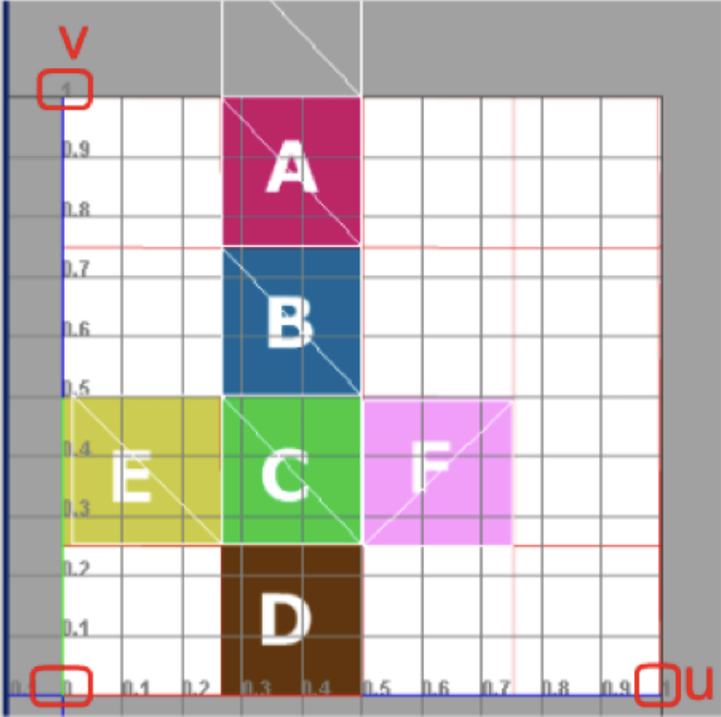
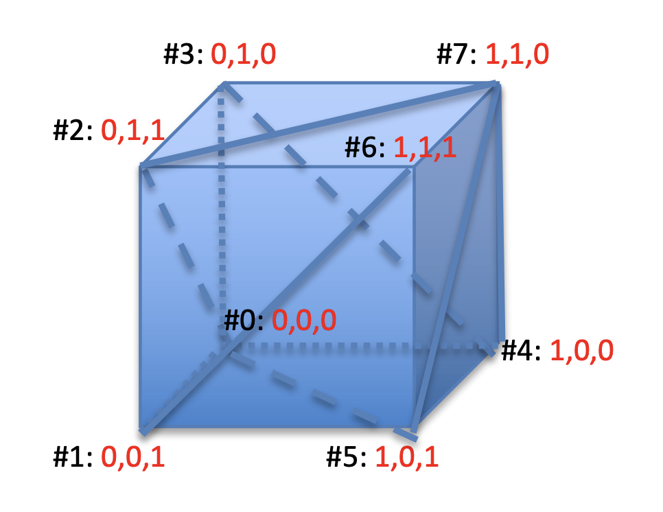

# Assignment 19 (Vertex Normal Vectors, UV Coordinates)

## Vertex Normal Vectors

## Textures

2D textures are applied to 3D objects, using a mapping relation that associates  each point on the surface with a point on the texture. The mapping creates a correspondence between pixels of the texture (called texel) and points of the object.

Points over 2D Textures are  addressed using a Cartesian  coordinate system, whose  axes are called u and v. This set of coordinates are  usually called **UV**, mapping or **texture coordinates**.

Note that UV coordinates are assigned only to the vertices of the triangles.

## Perspective Interpolation

If perspective is used, interpolation cannot be done in the conventional way due to the non-linearity of the projection.

To avoid such wobbling effects, applications use perspective  correct interpolation. With this technique, interpolation is non-linear, and depends on the distance of the interpolated points from the projection plane.

Perspective correct interpolation uses the formula below. In practice, it interpolates the value of the parameters $u$ divided  by the distance $z$. And then brings back everything to its correct dimension dividing by the interpolated version of $1/z$:
$$
u(\alpha)=\frac{\alpha \frac{u_{1}}{z_{1}}+(1-\alpha) \frac{u_{2}}{z_{2}}}{\frac{\alpha}{z_{1}}+\frac{(1-\alpha)}{z_{2}}}
$$
As introduced, an internal point $(x_S,y_S)$ of a triangle can be  considered as a linear combination its three vertices $(x_1,y_1)$, $(x_2,y_2)$,  $(x_3,y_3)$ with coefficients that sums up to one:
$$
\left(x_{S}, y_{S}\right)=\left(x_{1}, y_{1}\right) \cdot \alpha_{1}+\left(x_{2}, y_{2}\right) \cdot \alpha_{2}+\left(x_{3}, y_{3}\right) \cdot \alpha_{3}
$$
with:
$$
\alpha_{1}+\alpha_{2}+\alpha_{3}=1
$$
If we call $u_{1}, u_{2}$ and $u_{3}$, the value of a parameter $u$ at the three vertices, the value $u_{s}$ at $\left(x_{s} y_{s}\right)$ with perspective correct interpolation can thus be computed as:
$$
u_{S}=u\left(\alpha_{1}, \alpha_{2}, \alpha_{3}\right)=\frac{\alpha_{1} \frac{u_{1}}{z_{1}}+\alpha_{2} \frac{u_{2}}{z_{2}}+\alpha_{3} \frac{u_{3}}{z_{3}}}{\frac{\alpha_{1}}{z_{1}}+\frac{\alpha_{2}}{z_{2}}+\frac{\alpha_{3}}{z_{3}}}
$$

## The assignment

### The cube

* Back Face
  * Bottom left: 0, 0, 0
  * Bottom right: 1, 0, 0
  * Top left: 0, 1, 0
  * Top right: 1, 1, 0
    * ... and so on

